# 🛡️ Система обліку військовослужбовців


Веб-застосунок для автоматизації обліку особового складу, ведення статистики та керування даними військового підрозділу. Проєкт розроблено як курсову роботу з використанням стеку MERN (MongoDB, Express, React-logic/Vanilla JS, Node.js).

🔗 **[Демонстрація (Live Demo)](https://kursova-28w0.onrender.com)**
*(Примітка: Перший запуск може тривати до 50 секунд, оскільки сервер знаходиться на безкоштовному хостингу)*

---

## 📋 Функціонал

### 🔒 Безпека та Доступ
* **Авторизація:** Вхід та реєстрація через JWT токени.
* **Ролі:**
    * **Admin:** Повний доступ (CRUD), керування іншими користувачами, зміна налаштувань.
    * **User:** Перегляд статистики, пошук, фільтрація (режим Read-Only, крім зміни статусу).
* **Захист:** Хешування паролів (bcryptjs), захищені маршрути API.

### 📊 Робота з даними
* **Дашборд:** Інтерактивні графіки (Chart.js) по статусах, званнях та групах крові.
* **CRUD Персоналу:** Додавання, редагування та видалення карток військовослужбовців.
* **Фільтрація:** Пошук за прізвищем/ID, фільтр за статусом (Активний/У відпустці/Неактивний) та вибір конкретного підрозділу.
* **Адаптивність:** Повністю адаптивний дизайн з мобільним "гамбургер-меню".

---

## 📸 Скріншоти роботи

### 1. Авторизація
Вхід у систему. Якщо у вас немає акаунту, ви можете зареєструватися.

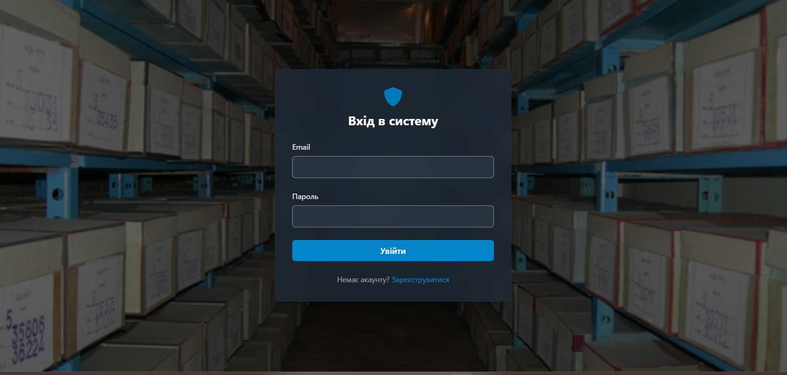

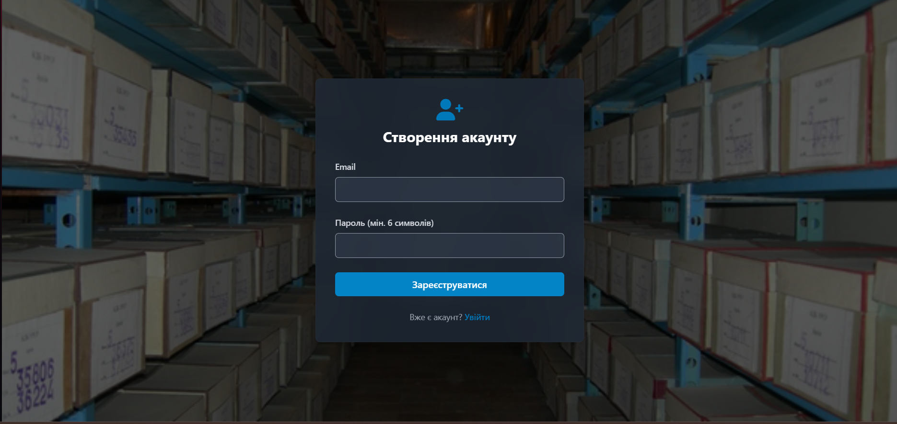

### 2. Головний Дашборд
Відображення загальної статистики по обраному підрозділу.

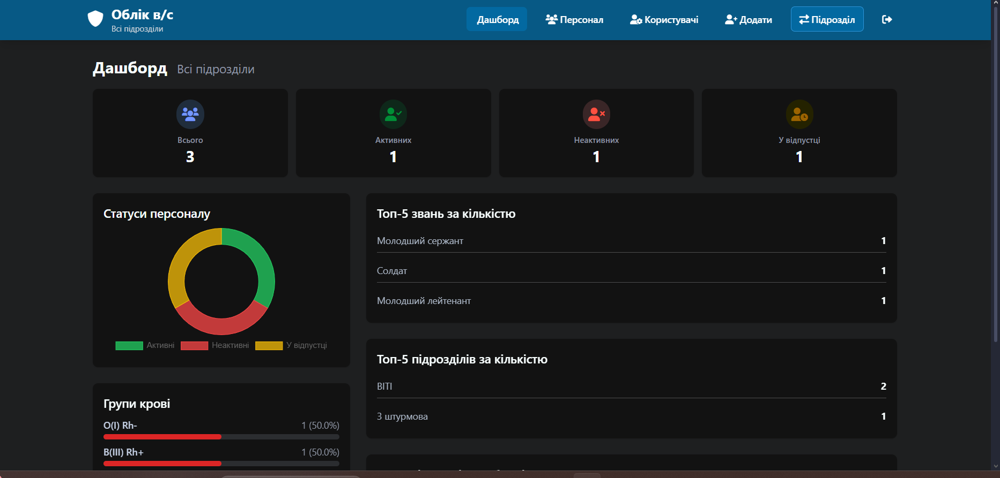
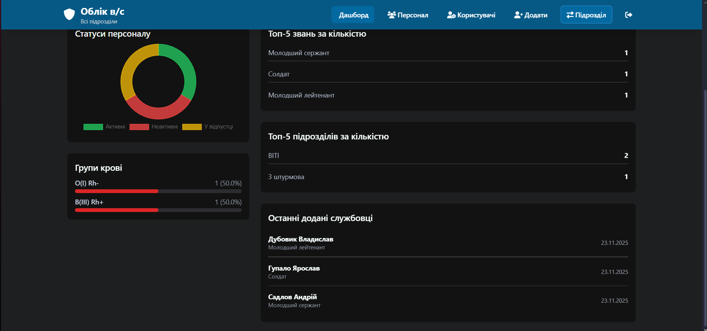

### 3. Мобільна версія
Адаптований інтерфейс для зручної роботи з телефону.

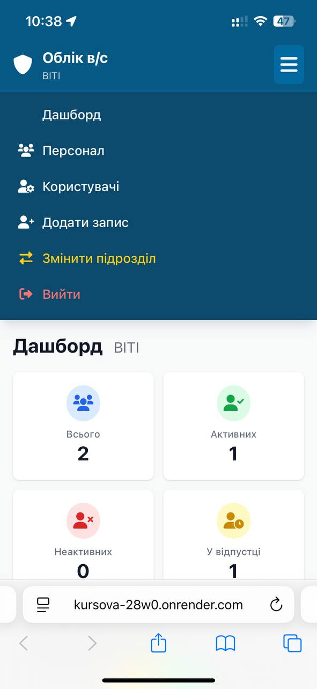

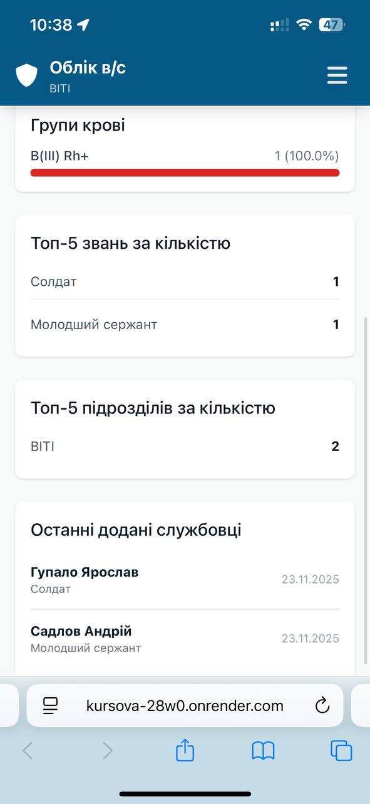

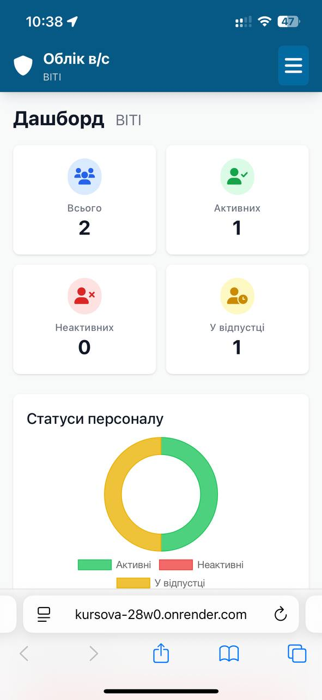

### 4. Список персоналу
Таблиця з даними, пошуком та кнопками керування.

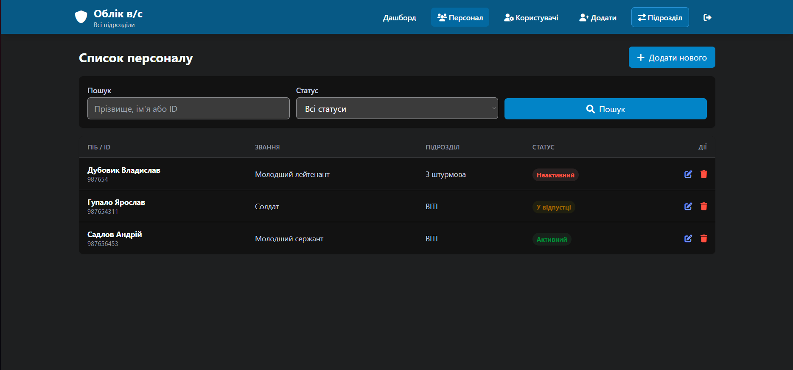

#### Приклад: шукаємо військовослужбовця за призвіщем

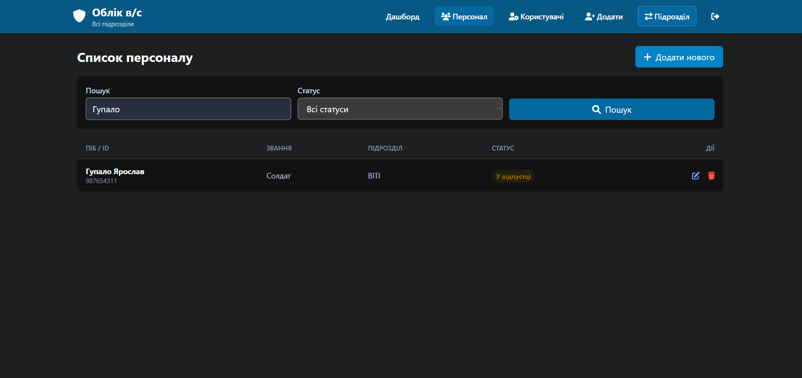

### 5. Адмін-панель (Керування користувачами)
Спеціальний інтерфейс для зміни ролей інших користувачів.(⚠️Доступно тільки для користувачів з ролю адмін)

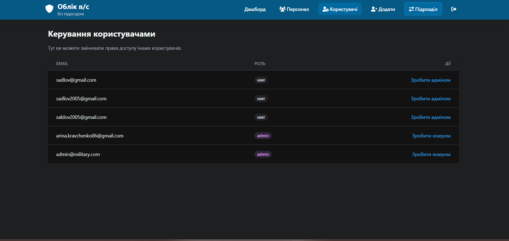

### 6. Додавання військовослужбовців (Внесення персональних данних)
Інтерфейс з внесенням основних данних про військовослужбовця(ПІБ, підрозділ, звання, дати , група крові , контактна інформація, захворення)

⚠️Тільки адміни(командири) можуть додавати данні про військовослужбовців , звичайні користувачі можуть тільки змінити статус наприклад щоб показати що він у відпустці

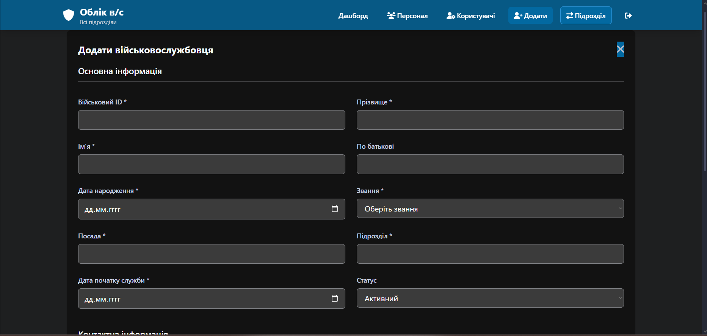

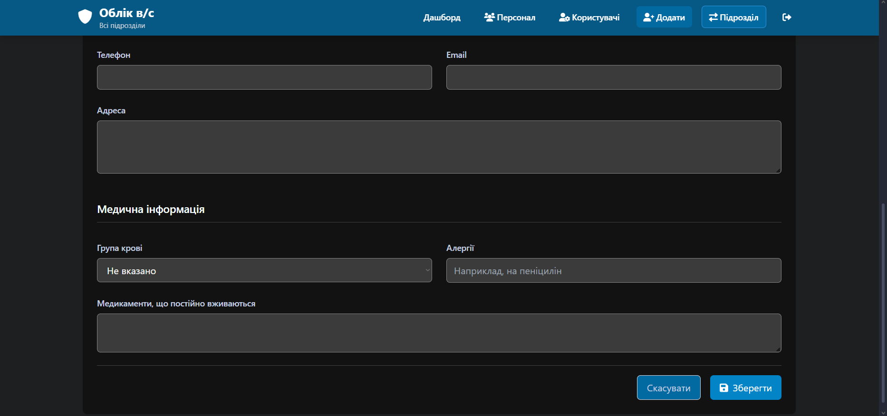

### 7. Вікно вибору підрозділу (Щоб бачити статистику та інформацію по конкретному підрозділу)
При вході нам показує вікно вибору підрозділу який нам потрібний 

⚠️У адмін користувачів є можливість бачити всю інформацію про всі підрозділи

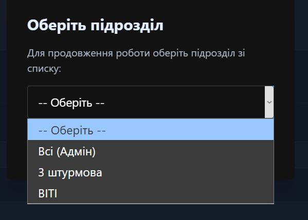

---

## 🛠️ Технології

* **Frontend:** HTML5, TailwindCSS, JavaScript (ES6+), Chart.js.
* **Backend:** Node.js, Express.js.
* **Database:** MongoDB Atlas (Mongoose ODM).
* **Deploy:** Render (Web Service).

---

## ⚙️ Як запустити локально

Якщо ви хочете розгорнути цей проєкт на своєму комп'ютері:

1.  **Клонуйте репозиторій:**
    ```bash
    git clone [https://github.com/AndrijSadlov/kursova.git](https://github.com/AndrijSadlov/kursova.git)
    cd kursova
    ```

2.  **Встановіть залежності:**
    ```bash
    npm install
    ```

3.  **Налаштуйте змінні середовища:**
    Створіть файл `.env` у корені проєкту і додайте:
    ```env
    PORT=3000
    MONGO_URI=ваше_посилання_на_mongodb
    JWT_SECRET=ваш_секретний_ключ
    ```

4.  **Запустіть сервер:**
    ```bash
    npm start
    ```

5.  Відкрийте у браузері: `http://localhost:3000`

---

## 📂 Структура проєкту

```text
.
├── controllers/       # Логіка (Auth, Personnel, Users)
├── middleware/        # Перевірка токенів (Auth Middleware)
├── models/            # Схеми бази даних (Mongoose schemas)
├── public/            # Фронтенд (HTML, CSS, JS)
├── routes/            # Маршрути API
├── server.js          # Головний файл сервера
└── README.md          # Документація